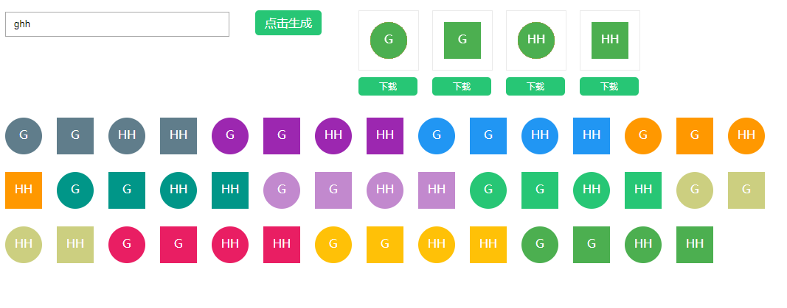

# avatar-generate-byname

通过用户名生成头像(SVG版本), 简易版，见参考项目，更多功能。

[点击进行具体效果体验](https://zzugbb.github.io/avatar-generate-byname/)

可以取 `first name` 或 `last name`, 如果是英文，则会转为大写。 具体示例如下:

生成后可以右键下载对应 `SVG文件`

## 参考

* [namedavatar](https://github.com/joaner/namedavatar)